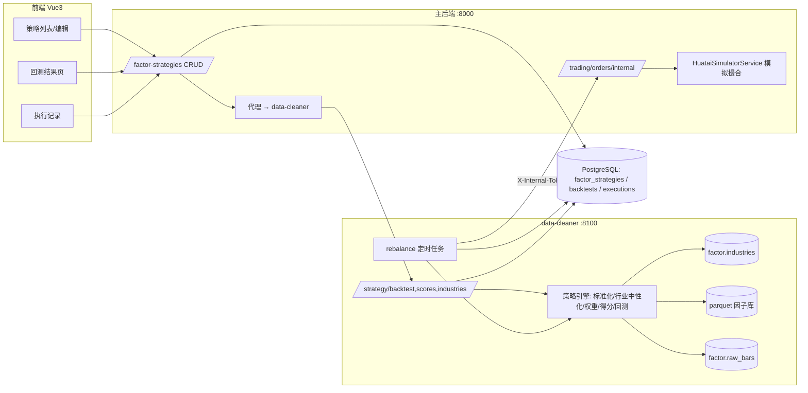

## 用户需求

在 `quant/strategy` 下新增**因子选股策略**（配置型，与现有"代码型"策略并存）：

1. 可选择现有因子组合（多因子，如价值 + 动量）
2. 可配置交易方案（固定时间买卖）
3. 回测/模拟盘应用时的计算规则：

- 分别对因子做**标准化**和**行业中性化**处理
- 根据历史 ICIR 确定权重（如价值 0.6、动量 0.4）
- 每只股票综合得分：`Score = Σ w_i × Z_i`
- 选取得分最高的前 N 只（可配置）构建持仓

## 澄清确认（用户已选定）

- **中性化**：行业中性化（tushare `stock_basic` 行业分类，行业内去均值/标准化）
- **应用形态**：历史回测（净值/指标）+ 接入现有 trading 模拟交易模块，按调仓日**自动下模拟订单**；不做实盘
- **权重**：两种都支持——默认按历史 `|IR|` 自动归一化，界面可手动覆盖
- **调仓**：策略可指定交易时间；建立定时任务，到点读取标的成交价执行

## 核心功能

- 策略 CRUD：因子组合、权重模式（auto_ir / manual）、中性化模式、topN、调仓周期（每周/每月/每N日）、交易时间（HH:MM）、初始资金、过滤条件（排除ST/新股）
- 回测：净值曲线、年化收益/夏普/最大回撤/胜率/换手率、各期持仓明细、防前视（权重与得分只用 T 日前数据）
- 模拟盘执行：定时扫描到点策略，算目标持仓 → 取最新收盘价 → 调主后端 trading 下 LIMIT 模拟订单 → 记录执行历史

## 数据约束（必须遵守）

- raw_bars 只有 OHLCV → 行业分类需经 tushare 拉取并**落库缓存**
- 只有日线（EOD）数据 → 成交价取"执行时点最新可得收盘价"的合理近似；回测用 T 收盘信号、T+1 开盘成交
- 价值/成长类 6 个因子当前为空（缺财务数据）→ 创建策略时过滤/警告，不可直接选用
- 无交易日历依赖 → 复用现有"周末跳过"粗判，法定节假日空跑可接受

## 技术选型

复用现有技术栈，不引入新框架：

- **主后端**（:8000）：FastAPI + SQLAlchemy + PostgreSQL（public schema，策略配置/执行记录/回测结果表）
- **data-cleaner**（:8100）：FastAPI + pandas + APScheduler（策略计算与调仓执行，贴近因子/行情数据）
- **前端**：Vue 3 + Element Plus + ECharts（与现有 quant/factor 页面一致）
- **数据**：parquet 因子库（`data/factors/{category}/{date}.parquet`，index=symbol）+ PG `factor.raw_bars` + tushare 行业分类

## 实施方案

### 关键决策

1. **配置型策略独立建表**：现有 `strategies` 表是代码型（`code` NOT NULL），不强行复用；新建 `factor_strategies`（JSONB 存因子组合与权重）。回测/执行记录各自建表，互不干扰。

2. **计算放 data-cleaner，主后端做 CRUD + 代理**：因子截面与行情都在 data-cleaner，避免经 HTTP 搬 581k 行数据；与既有 `factor_proxy` 模式一致（主后端 `/api/v1/factor-strategies` → 代理 data-cleaner `/api/v1/strategy/*`）。

3. **行业分类缓存表**：新建 `factor.industries`（migration 004），定时任务每周从 tushare `stock_basic` 刷新（fields 加 `industry`），计算时直接读表，不在每次调仓时调 API。

4. **行业中性化**：对每只股票按其所属行业的均值与标准差做 z-score（`z = (x - mean_industry) / std_industry`），行业内样本 <5 时退化为全市场 z-score。

5. **权重**：

- 回测：每个调仓点 T，在回看窗口（默认 60 个交易日，可配）内用**截至 T 日**的因子值与次日收益算各因子截面 IC 序列 → IR → `w_i = |IR_i| / Σ|IR|`（**防前视**）；IR 全为 0 时退化为等权
- 实时执行：直接用最新一期 `factor.metrics` 的 IR（流水线每日已算）
- 手动模式：直接用配置里的 weights JSON

6. **回测规则**：调仓日 T 收盘算分选 top-N → **T+1 开盘价**等权买入 → 持有至下一调仓周期 T+1 开盘卖出再换仓；逐日盯市出净值曲线。指标：总收益/年化/夏普（年化）/最大回撤/胜率（调仓期为胜的占比）/换手率。

7. **模拟盘执行（定时任务）**：data-cleaner 加一个**扫描型 cron**（交易时段每 15 分钟，`max_instances=1`）：扫描 `is_active` 且今日为调仓日、`trade_time` 已到、且当日无执行记录的策略 → 算目标持仓（对比当前模拟持仓计算买卖清单）→ 取最新收盘价 → 调主后端**内部下单端点** → 写入 `factor_strategy_executions`。幂等：以 `(strategy_id, rebalance_date)` 去重。

8. **内部下单鉴权**：主后端新增 `STRATEGY_INTERNAL_TOKEN`（.env），新增 `POST /api/v1/trading/orders/internal`：校验 `X-Internal-Token` 头 + 显式传 `user_id`，复用 `HuataiSimulatorService` 下单与风控；不走用户 JWT（定时任务无用户会话）。

9. **成交价**：日线数据下取"执行时点最新可得收盘价"作 LIMIT 价；数量按 `可用资金 / topN / 价格` 取整到 100 股（A 股整手）。若后续接实时行情，仅替换取价一处。

10. **可配过滤器**：`exclude_st`（默认 true，按 tushare name 含 "ST" 判断）、`min_list_days`（默认 60，按 tushare list_date 判断）、标的无有效因子值或最新价缺失自动剔除（天然覆盖停牌）。

### 性能考量

- 回测面板一次性加载（约 581k 行 × 30 因子，已在 `factor_evaluate.load_factor_panel` 验证约数秒可完成），调仓循环为截面级操作（O(dates × topN)），156 日 × 周频约 30 期，秒级完成
- 权重按 `(strategy_id, rebalance_date)` 计算并缓存到执行/回测记录，避免重复算 IC 序列
- 行业表 5500 行，计算时按 symbol join，O(1) 查询
- 定时任务扫描很轻（读几张小表），重计算只在真正到点且未执行时才发生

### 架构



## 目录结构

```
backend/
├── app/models/quant.py                          # [MODIFY] 新增 FactorStrategy / FactorStrategyBacktest / FactorStrategyExecution 三个模型（独立表，不动现有 Strategy）
├── app/schemas/factor_strategy.py               # [NEW] 策略 CRUD/回测/持仓/执行记录的 pydantic 模型（factor_codes, weights, weight_mode, neutralize, top_n, rebalance, trade_time, filters）
├── app/services/factor_strategy_proxy.py        # [NEW] 代理 data-cleaner 策略计算接口（复用 factor_proxy 的 _request/pick_service 模式）
├── app/api/api_v1/endpoints/factor_strategy.py  # [NEW] /factor-strategies CRUD + /{id}/backtest、/{id}/holdings、/{id}/executions（代理/直查）
├── app/api/api_v1/endpoints/trading.py          # [MODIFY] 新增 POST /orders/internal（X-Internal-Token + user_id，复用模拟撮合与风控）
├── app/api/api_v1/api.py                        # [MODIFY] 注册 factor_strategy 路由
└── .env                                         # [MODIFY] 增加 STRATEGY_INTERNAL_TOKEN（生成随机值）

data-cleaner/
├── migrations/004_factor_strategy.sql           # [NEW] factor.industries 表（symbol PK, industry, list_status, list_date, name, updated_at）
├── app/industry/store.py                        # [NEW] 行业分类缓存读写 + tushare 拉取/降级
├── app/strategy/engine.py                       # [NEW] 策略引擎：standardize / industry_neutralize / resolve_weights(防前视IR) / composite_score / select_top_n / run_backtest
├── app/tasks/strategy_rebalance.py              # [NEW] rebalance 扫描执行器：读 active 策略→算目标持仓→取价→HTTP 调主后端下单→写 executions（幂等）
├── app/tasks/industry_refresh.py                # [NEW] 行业分类每周刷新任务
├── app/tasks/scheduler.py                       # [MODIFY] 注册 strategy_rebalance（交易时段每15分钟扫描）与 industry_refresh（周六）
├── app/api/v1/strategy.py                       # [NEW] /strategy/backtest、/strategy/scores、/strategy/industries/refresh（受 X-API-Key 保护，与现有接口一致）
├── app/api/v1/api.py                            # [MODIFY] 注册 strategy 路由（确认该文件的注册方式后并入）
└── app/storage/db.py                            # [MODIFY] 如需补 industries 的读函数

frontend/apps/web-ele/src/
├── api/factor-strategy.ts                       # [NEW] 策略 CRUD/回测/持仓/执行记录 API + 类型
├── views/quant/strategy/index.vue               # [MODIFY] 增加「因子策略」Tab/区块（与代码型策略并存）
├── views/quant/strategy/factor/                 # [NEW]
│   ├── factor-strategy-list.vue                 # [NEW] 因子策略卡片列表（状态、因子组合、topN、下次调仓）
│   ├── factor-strategy-form.vue                 # [NEW] 创建/编辑弹窗：因子多选（带分级徽标）、权重模式+权重滑杆、中性化、topN、周期、交易时间、过滤器、初始资金
│   └── factor-strategy-detail.vue               # [NEW] 详情页：回测净值曲线(ECharts)、指标卡、各期持仓、调仓/下单执行记录
└── views/quant/strategy/factor/types.ts         # [NEW] 前端类型（FactorStrategy、BacktestReport、ExecutionRecord）
```

## 关键接口约定（精确到字段）

**FactorStrategy 配置（JSONB）**

```
{
  "factor_codes": ["VAL_PE_PERCENTILE", "MOM_RET_60"],
  "weights": {"VAL_PE_PERCENTILE": 0.6, "MOM_RET_60": 0.4},
  "weight_mode": "auto_ir",
  "neutralize": "industry",
  "top_n": 30,
  "rebalance": {"freq": "weekly", "every_n_days": null},
  "trade_time": "10:00",
  "initial_capital": 1000000,
  "filters": {"exclude_st": true, "min_list_days": 60},
  "lookback_days": 60,
  "is_active": false
}
```

**POST /api/v1/trading/orders/internal**
请求头 `X-Internal-Token`；body 在 `OrderRequest` 基础上加 `user_id: int`。校验 token 后复用 `get_trading_service(user_id)` 下单（走风控）。

**data-cleaner POST /api/v1/strategy/backtest**
body = 策略配置 + `{start_date, end_date}`；返回 `{metrics, nav[], rebalances[{date, weights, holdings[{symbol, score, weight}]}], warnings[]}`（warnings 如"VAL_PE_TTM 无因子值已剔除"）。

## 设计风格

与项目现有 Element Plus 管理端保持一致（不引入新组件库），复用 factor 页已建立的视觉语言：卡片式布局、蓝紫主色、类别色标签、分级徽标（金/橙/蓝/灰）、ECharts 图表。页面简洁专业，信息密度适中。

## 页面规划（1 个主页面改造 + 1 个详情页）

### 1. quant/strategy 策略页（改造，加 Tab）

- **顶部 Tab 区**：「代码策略」（现有）|「因子策略」（新增），border-card 样式与 factor 页一致
- **统计条**：4 个统计卡（策略总数 / 启用中 / 今日已执行 / 平均年化），ElStatistic + 图标
- **策略卡片网格**：每卡显示策略名、因子组合标签（类别色）、topN、调仓周期、交易时间、最近回测年化、启用开关（ElSwitch）、操作（回测/详情/编辑/删除）
- **创建/编辑弹窗**（900px）：
- 基本信息：名称、描述
- 因子组合：ElSelect multiple 从因子库选（带类别/分级徽标），已选因子逐行显示 + 权重滑杆（手动模式）或"按IR自动"提示
- 处理与过滤：中性化模式（行业中性化/仅标准化）、topN（ElInputNumber 5~100）、排除ST/上市天数
- 交易方案：调仓周期（每周/每月/每N日）、交易时间（ElTimePicker）、初始资金
- 底部：保存 / 保存并立即回测
- **空态**：引导创建第一个因子策略

### 2. 因子策略详情页（新增）

- **头部摘要**：策略名 + 状态标签 + 关键配置 chip（因子组合、topN、周期、交易时间）+ 操作按钮（立即回测、暂停/启用、编辑）
- **指标卡区**：总收益、年化收益、夏普、最大回撤、胜率、换手率（正负值红绿着色）
- **净值曲线区**：ECharts 折线（组合净值 vs 基准），支持区间缩放；调仓点用标记点标出
- **持仓明细区**：调仓期切换下拉 + ElTable（标的、行业、综合得分、各因子 z 值、目标权重）
- **执行记录区**：ElTable（调仓日、目标持仓数、买卖订单数、成交金额、状态、失败原因），失败行可展开看订单明细
- **权重快照区**：最近一次 auto_ir 实际使用的权重（横向条形图或标签），便于用户理解"IR 归一化"的结果

## 交互与响应式

- 桌面端优先（≥1200px），卡片网格 3 列，详情页左右分栏
- 加载态统一 v-loading；错误用 ElAlert + ElMessage；长任务（回测）按钮 loading + 完成后消息提示
- 无因子值的因子在选项中置灰并提示"暂无因子值"