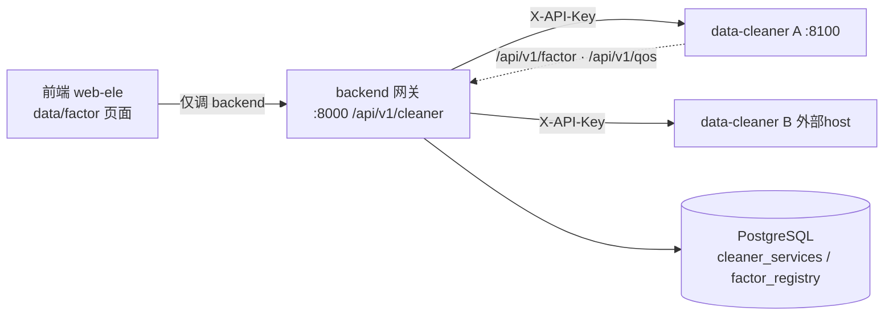

## User Requirements

规划"多数据清洗服务"架构并输出可实施的方案文档到 `docs/plans/`，供其他 agent 按步骤实施：

- 管理后台因子库的因子来自**多个**数据清洗服务
- 后台（data/factor 页面）管理清洗服务：录入 host/url + 认证 key 建立连接（CRUD）
- 清洗服务提供统一因子列表接口，供后台勾选因子"入库"
- 清洗服务提供 QoS 接口供后台检测状态；离线服务的因子标注"离线"

## Product Overview

以 backend 为注册中心 + 聚合网关的三层架构：前端只调 backend；backend 管理服务连接信息、代理拉取各清洗服务的因子与 QoS、维护入库因子表；data-cleaner 改造为可注册的标准化服务（统一因子接口 + /qos + API Key 认证）。

## Core Features（用户已确认的三大决策，必须遵循）

1. **聚合架构 = backend 网关/注册中心**：连接信息(host/url/key)存 backend DB；前端不直连清洗服务；key 不外泄、无跨域问题
2. **因子入库 = backend DB 新建因子表**：入库因子含来源服务ID；「因子底册库」展示聚合因子，带来源服务名与在线/离线标注
3. **现有「清洗服务」tab 改造为多服务管理**：服务 CRUD + QoS 检测 + 勾选入库，取代现有单服务直连逻辑

## 交付物

- `docs/plans/2026-08-26.multi-cleaner-gateway.md`：含架构图、数据模型、QoS/认证契约、网关 API 契约、前端改造点、分阶段实施步骤（标注前后端边界与依赖顺序）、验证清单

## Tech Stack

- backend：FastAPI + SQLAlchemy 2.0 async + PostgreSQL（复用现有 `backend/app/core/database.py` 的 Base/get_db；模型风格参照 `models/quant.py`；endpoint 风格参照 `endpoints/quant.py`，统一 `Response.success(data=...)` 包装 + `get_current_user` 鉴权）
- data-cleaner：FastAPI（复用 `config.py` BaseSettings 模式加 API Key/服务名配置；新增 core/security 依赖注入）
- 网关 HTTP 客户端：httpx AsyncClient（超时+并发 asyncio.gather）
- frontend：Vue3 `<script setup>` + TS；调 backend 用 `requestClient`（匹配 backend Response 的 {code,data} 包装）；原生 el-* 组件必须在 script setup 显式 import（web-ele 无 unplugin 自动注册）

## Implementation Approach

网关模式：frontend → backend `/api/v1/cleaner/*` → 各 data-cleaner 实例。backend 持 httpx 客户端按服务注册信息转发 `GET {base_url}/api/v1/factor` 与 `/api/v1/qos`（注入 `X-API-Key`）。因子离线状态**不做冗余存储**，查询时 join 服务表 status 派生，保证一致性。QoS 检测为按需触发（页面挂载/手动刷新）+ qos_snapshot 缓存，避免引入后台定时任务的复杂度。

## Architecture Design



## Directory Structure

```
docs/plans/
└── 2026-08-26.multi-cleaner-gateway.md  # [NEW] 本计划唯一产物：实施方案文档
文档中将规定（供实施 agent 执行的目标文件，不在本计划创建）：
backend/app/models/cleaner.py            # CleanerService + FactorRegistry 两表
backend/app/schemas/cleaner.py           # 服务/因子 Pydantic schema（key 响应脱敏）
backend/app/services/cleaner_gateway.py  # httpx 代理 + QoS 检测 + 离线判定
backend/app/api/api_v1/endpoints/cleaner.py  # 网关 API，注册到 api.py prefix=/cleaner
data-cleaner/app/api/v1/qos.py           # [NEW] GET /qos 契约实现
data-cleaner/app/core/security.py        # [NEW] X-API-Key 校验依赖
data-cleaner/app/core/config.py          # [MODIFY] 加 SERVICE_NAME / API_KEYS
frontend/apps/web-ele/src/api/cleaner-services.ts  # [NEW] 网关 API 层(requestClient)
frontend/apps/web-ele/src/views/data/factor/components/cleaner-service.vue  # [MODIFY] 多服务管理
frontend/apps/web-ele/src/views/data/factor/index.vue  # [MODIFY] tab 重命名/挂载
frontend/apps/web-ele/vite.config.ts     # [MODIFY] 移除 /api/v1/factor、/api/v1/pipeline 直连代理
```

## Key Code Structures

```python
# data-cleaner QoS 契约 GET /api/v1/qos →
{ "service": str, "version": str, "status": "online",
  "uptime_seconds": int, "factor_count": int,
  "last_pipeline": {"status": str, "rows_in": int, "rows_out": int,
                    "duration_ms": int, "date": str, "error": str | None},
  "checked_at": str }  # ISO8601

# backend 表设计要点
# cleaner_services: id, name, base_url(唯一), auth_key(加密存储/响应脱敏),
#   description, enabled, status(online/offline/unknown), last_check_at,
#   qos_snapshot(JSON), created_at, updated_at
# factor_registry: id, code, name, category, frequency, formula,
#   data_sources(JSON), source_service_id(FK→cleaner_services),
#   imported_at, updated_at; 唯一约束(source_service_id, code)
```

## Agent Extensions

### Skill

- **doc-coauthoring**
- Purpose: 按结构化工作流组织设计文档（背景/契约/步骤/验证），确保文档对实施 agent 可读可执行
- Expected outcome: 产出结构完整、章节清晰的 `docs/plans/2026-08-26.multi-cleaner-gateway.md`
- **postgresql-table-design**
- Purpose: 设计 cleaner_services / factor_registry 两表的字段类型、索引、唯一约束与外键策略（含离线状态 join 派生、删除级联决策）
- Expected outcome: 文档中的数据模型章节符合 PostgreSQL 最佳实践，可被直接照搬建表