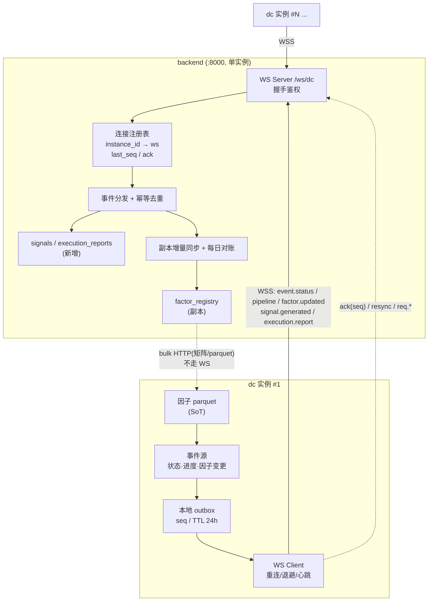

## 产品概述

将 `data-cleaner`(dc, :8100) 与 `backend`( :8000) 之间的通讯从"HTTP 单向请求-响应 + 30s 轮询"升级为 **WebSocket 长连接**。本轮交付物为**设计文档 v3**,不改任何代码。

## 核心需求

1. **拓扑(已确认)**:backend **单实例**作 WebSocket **服务端**(`/ws/dc`),N 个 dc 实例作**客户端**拨出,**1 对多**;dc 主动连 backend。
2. **因子所有权(根基,已纠正)**:**dc 是因子的源(SoT)**——因子在 dc 计算、落 parquet、经 `/api/v1/factor` 暴露;backend 的 `factor_registry` 只是**副本**,存在意义仅是前端查看时不打 dc。因此 **dc→backend 的因子更新广播是副本同步通道,属根基,不是可选优化**。
3. **副本一致性(已选定)**:最终一致 —— 广播触发增量同步 + **每日对账**;需开启 `ENABLE_FACTOR_SYNC`(当前默认 False)并新增对账机制发现缺失/冗余。
4. **信号(已选定:仅预留框架)**:定义 `strategy.compute`(backend→dc)与 `signal.generated`(dc→backend)的消息结构与处理入口,**不实现信号生成逻辑**。语义为:backend 提交策略 → dc 用行情/因子计算 → 推信号给 backend → **backend 走风控与最终决策**;另一条路是 dc 直接撮合成交(不发信号)。
5. **成交回报(已选定)**:dc 直接撮合成交模式下,**需回推成交报告**(`event.execution.report`)并落库,让 backend 感知持仓变化。
6. **首期范围(已选定)**:连通/重连/outbox **与**因子副本广播**同批上线**,先把根基立住。
7. **bulk 边界**:因子矩阵、correlation(N×N)、parquet/区间数据**一律不走 WS**,继续 HTTP;WS 只传通知与小载荷。
8. **Redis**:按现有设计保留(仅 last_seq 持久化、事件去重、状态缓存),细节后续讨论。

## 技术栈

- 服务端/客户端框架:两侧均为 **FastAPI + Uvicorn**,WebSocket 用 FastAPI 原生 `WebSocket`(dc 客户端用 `websockets` 或 `httpx_ws`)
- 现有 HTTP 客户端:backend 侧 `httpx.AsyncClient`(保留作回退与 bulk 通道)
- 存储:PostgreSQL(backend 的 `quant_db`;dc 的 `quant` 库 `factor` schema);dc 侧 outbox 用本地 SQLite/文件
- 可选:Redis(单副本下非必需,仅 last_seq 持久化与事件去重)
- 序列化:JSON + `permessage-deflate`;契约用 JSON Schema 约束

## 实现方案

**方向模型**:dc 拨出建立长连接后双向复用 —— dc 上推事件(状态/进度/因子变更/信号/成交报告),backend 沿同一连接下发请求与 `ack`/`resync`。

**为什么 outbox 在 dc(发送侧)**:dc→backend 是主推方向,dc 是客户端(负责重连),故缓冲与补发职责归 dc;backend 只需按 `seq` 回 `ack`、按事件 `id` 去重。

**为什么 bulk 不走 WS**:单条连接内大消息会造成**队头阻塞**(拖死心跳/控制消息)、单帧内存放大、背压失效。因子矩阵/correlation/parquet 继续 HTTP,WS 只发"数据就绪"通知(仅 code + 版本)。

**为什么 backend 单副本使复杂度骤降**:连接注册表退化为**进程内 dict**,v1 设想的 Redis 选主/fan-out 全部消失;Redis 降为可选。

**关键约束**:推送必须**异步化**,失败仅入 outbox 并告警,**绝不阻塞 EOD 主流水线**。

## 架构设计



## 实施要点(基于已核实的代码事实)

- **鉴权**:复活死配置 `BACKEND_BASE_URL`(`data-cleaner/app/core/config.py:48`,改 `ws://`/`wss://`)+ `STRATEGY_INTERNAL_TOKEN`(`:50`,当前为空、全仓零引用);dc 在 HTTP 升级请求头带 `X-Internal-Token`;backend 复用 `trading.py:432` `verify_internal_token` 思路。
- **削峰**:`poll_qos`(`cleaner_gateway.py:92-104`,30s×每服务)降为**仅对未连接实例 5min 兜底**。
- **对账**:`sync_factors`(`:243-288`)现状"只更新已入库记录、不新增、无对账" → 必须补对账,否则副本静默漂移(这是本次纠正暴露的最脆弱点)。
- **信号 schema 缺口**:`compute_target`(`app/strategy/engine.py:935`,输出见 `:1027-1044`)**缺 `strategy_id` 与 `direction`**,预留时需补齐;`top_n` 默认 30(`:941`),单包可承载无需分片。
- **顺带修的既有缺陷**:`publish_status`(`app/storage/cache.py:68-70`)名为 publish 实为 KV 写入、且 30s 心跳覆盖流水线报告;`_last_report`(`app/api/v1/pipeline.py:45`)进程内全局变量;`api_key`(`backend/app/models/cleaner.py:30`)注释称 AES 实为明文;backend 全仓**无重试/退避/熔断**。
- **回退**:每阶段独立开关;HTTP 路径全程保留;版本协商失败自动回退 HTTP。
- **运维坑**:LB/代理空闲超时必须 **大于**心跳间隔(WS ping 15s + 应用 ping 30s,连续 3 次无响应判死)。

## 目录结构

```
docs/plans/
└── 2026-09-04.ws-dc-backend.md          # [MODIFY] 修订为 v3：纠正因子源/副本、因子广播提为根基、
                                          #   信号改为仅预留、新增 event.execution.report 通道设计

backend/app/ws/                           # [NEW] WebSocket 能力目录
├── __init__.py                           # [NEW] 模块导出
├── protocol.py                           # [NEW] 信封定义({v,id,type,ts,seq,corr_id,payload,meta})、
                                          #   消息类型常量、编解码、版本协商；与 dc 侧共用契约
├── server.py                             # [NEW] WS 服务端 /ws/dc、握手鉴权(X-Internal-Token)、
                                          #   单帧上限、连接数/速率限流
├── registry.py                           # [NEW] 进程内连接注册表 instance_id→ws，维护 last_seq、
                                          #   回 ack、resync 请求、在线状态
└── handlers.py                           # [NEW] 事件分发 + 按事件 id 幂等去重；
                                          #   status/presence/factor.updated/signal/execution 处理入口

backend/app/services/
├── factor_replica_sync.py                # [NEW] 因子副本同步：收到广播触发增量同步；
                                          #   每日对账(比对 dc 因子集合 vs 本地 factor_registry，
                                          #   发现缺失/冗余并告警)
└── cleaner_gateway.py                    # [MODIFY] poll_qos 降级为未连接实例的 5min 兜底；
                                          #   sync_factors 改由事件触发并补对账；保留 HTTP bulk 通道

backend/app/models/
├── cleaner.py                            # [MODIFY] 补 last_seq / protocol_version / ws 连接态字段
└── signal.py                             # [NEW] signals 与 execution_reports 表(本轮仅建模预留，
                                          #   含 signal_id 唯一键 = strategy_id+as_of)

backend/app/core/config.py                # [MODIFY] 新增 WS 开关、心跳/超时/单帧上限/重连参数
backend/app/api/api_v1/router.py          # [MODIFY] 挂载 /ws/dc 路由

data-cleaner/app/ws/                      # [NEW] WebSocket 能力目录
├── __init__.py                           # [NEW] 模块导出
├── protocol.py                           # [NEW] 与 backend 共用的信封与消息类型(Schema 防漂移)
├── client.py                             # [NEW] WS 客户端：连接、指数退避+抖动重连、按 instance_id
                                          #   错峰防惊群、心跳、发送队列
├── outbox.py                             # [NEW] 本地 outbox：seq 分配、持久化(TTL 24h)、
                                          #   按 ack 清理、重连后从 last_acked_seq+1 补发
└── events.py                             # [NEW] 事件源封装：status / presence / pipeline 进度 /
                                          #   factor.updated；发送失败仅入队，绝不阻塞 EOD

data-cleaner/app/core/config.py           # [MODIFY] 复活 BACKEND_BASE_URL(ws 形式)与
                                          #   STRATEGY_INTERNAL_TOKEN；新增 WS 开关
data-cleaner/app/tasks/scheduler.py       # [MODIFY] lifespan 内启停 WS client；心跳与状态改推事件；
                                          #   EOD 流水线结束后发 event.factor.updated
data-cleaner/app/storage/cache.py         # [MODIFY] 修正 publish_status：心跳与流水线报告分 key
data-cleaner/app/api/v1/pipeline.py       # [MODIFY] 进度改推事件；_last_report 保留兼容
data-cleaner/app/api/v1/factor.py         # [MODIFY] 因子定义/指标变更时发 event.factor.updated
data-cleaner/app/strategy/engine.py       # [MODIFY·仅预留] compute_target 输出补 strategy_id /
                                          #   direction 字段定义(不改算法，仅预留 schema)
```

## 关键代码结构

```python
# 信封(两侧共用，v=1；单帧 ≤256KB，超出走 HTTP 或分片)
# {"v":1,"id":"01J...","type":"event.factor.updated","ts":"...","seq":1024,
#  "corr_id":null,"reply_to":null,"payload":{...},"meta":{"chunk":null}}

# 消息目录(方向 / 性质)
# dc→backend: hello/bye, ping/pong, event.status[迁移], event.presence[迁移],
#             event.pipeline.*[迁移], event.factor.updated[新增·根基],
#             event.signal.generated[预留], event.execution.report[新增]
# backend→dc: ack(seq), resync.request(last_seq),
#             req.qos/res.qos[迁移·可选], strategy.compute[预留], req.scores/res.scores[迁移·可选]
```

```python
# 信号预留结构(本轮只定义，不实现生成)
# {"signal_id":"01J...","strategy_id":"uuid","as_of":"2026-09-03","trade_date":"2026-09-04",
#  "holdings":[{"symbol":"600519.SH","score":1.82,"weight":0.041,"direction":"buy",
#               "industry":"白酒","z_scores":{"MOM_20":1.2}}],
#  "diagnostics":{"hard_filter":{...},"weights":{...}}}
```

## Agent Extensions

### SubAgent

- **code-explorer**
- Purpose: 在每阶段动手前复核精确改动点(文件:行),确认无遗漏的 dc 调用点、因子写入点、调度注册点
- Expected outcome: 输出带 `文件:行号` 的改动清单与调用链,避免改漏/改错;尤其复核 `cleaner_gateway.py`、`scheduler.py`、`pipeline.py`、`factor.py` 的全部出口

### Skill

- **postgresql-table-design**
- Purpose: 设计新增表的 PostgreSQL schema —— `signals`、`execution_reports`、副本对账状态、`cleaner_services` 扩展字段(`last_seq`/`protocol_version`/连接态)、dc 侧 outbox 落库
- Expected outcome: 给出表结构、索引、唯一约束(`signal_id = strategy_id+as_of` 防重复推送)、外键与迁移脚本草案

### MCP

- **context7**
- Purpose: 拉取 FastAPI WebSocket 服务端与 `websockets` 客户端的权威用法(连接生命周期、ping/pong、断连处理、并发发送)
- Expected outcome: 避免 API 误用(尤其是同一连接并发 `send` 与断连竞态),为 `app/ws/server.py` 与 `app/ws/client.py` 提供正确范式