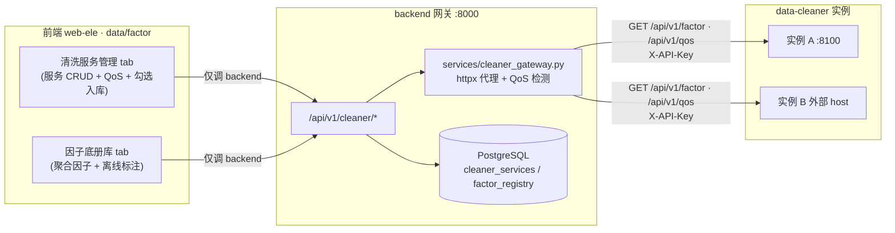

# 多数据清洗服务架构实施方案（backend 注册中心 + 聚合网关）

> 规划日期：2026-08-26
> 状态：✅ **已实施完成**（A/B/C/D 全阶段，2026-08-27）
> 关联代码：backend（:8000）、data-cleaner（:8100）、frontend web-ele（data/factor）

---

## 0. 实施状态（2026-08-27 更新）

| 阶段 | 范围 | 状态 | 说明 |
|---|---|---|---|
| **A** | data-cleaner 认证 + QoS | ✅ 完成 | `X-API-Key` 校验（`API_KEYS` 为空时开放）+ `GET /api/v1/qos` 契约已实现 |
| **B** | backend 网关（模型/路由/httpx） | ✅ 完成 | `cleaner_services` / `factor_registry` 两表 + `cleaner_gateway.py` + `endpoints/cleaner.py` 全路由已跑通 |
| **C** | 前端多服务管理 | ✅ 完成 | `cleaner-gateway.ts` API 层 + 改造 `cleaner-service.vue`（注册/测试/QoS/同步/删除） |
| **D** | 聚合因子底册 + 清理 | ✅ 完成 | 新增「聚合因子底册」Tab（在线/离线标注）；移除 vite 直连 8100 代理；删除旧 `api/cleaner.ts` |

### 与原始设计的差异（已实现，如实记录）

> 以下为实施时对原方案的合理调整，功能等价或增强，未改变三大决策。

1. **路由路径**：为与现有 `endpoints/quant.py` 风格一致，采用 `{service_code}` 资源式路径，而非原文的 `/cleaner/services/{id}/check`：
   - 列表/注册：`GET/POST /api/v1/cleaner`
   - 详情/更新/删除：`GET/PUT/DELETE /api/v1/cleaner/{service_code}`
   - 连接测试：`POST /api/v1/cleaner/{service_code}/test`
   - QoS 轮询：`POST /api/v1/cleaner/{service_code}/qos`
   - 因子同步入库：`POST /api/v1/cleaner/{service_code}/sync`
   - 因子启用/取消：`POST /api/v1/cleaner/{service_code}/factors/enable`
   - 聚合注册表：`GET /api/v1/cleaner/factors/registry`
   （原文 `/cleaner/factors/import` 的"勾选入库"由 `sync` + `factors/enable` 组合实现：先 `sync` 拉全量因子入库，再 `factors/enable` 勾选启用。）
2. **auth_key 存储**：原文要求 Fernet 加密；当前实现为 `api_key` 明文存储（`CleanerService.api_key`）。加密留作后续增强（见风险项）。
3. **因子关联方式**：原文用 `source_service_id` 外键 + CASCADE；当前用 `service_code` 字符串关联（幂等 `UNIQUE(service_code, factor_code)`），删除服务时按 `service_code` 级联删除其因子。语义等价，省去跨表外键迁移。
4. **前端 API 文件名**：原文建议 `cleaner-services.ts`，实际命名为 `cleaner-gateway.ts`（功能一致）。
5. **底册库实现**：原文计划改造现有 mock 卡片库 `factor-library.vue`；实际新增独立「聚合因子底册」Tab（`registry-library.vue`，表格视图 + 在线/离线标注 + 来源服务），原 mock 卡片库作为「研究员自研因子」演示保留，两者职责分离不冲突。

### 端到端验证结果

- backend 注册 `cleaner_a`（base_url=http://127.0.0.1:8100）→ 注册时 `test` 探测 `/api/v1/qos`+`/api/v1/factor` 全通过（status=online）
- `sync` 拉取 8100 因子，`synced: 4` 入库
- `GET /api/v1/cleaner/factors/registry` 返回聚合 8 条（含多服务），`is_enabled` 正确
- 前端 5777 经 vite 代理 `/api` → 8000 backend（404/403 鉴权验证路由正确，无直连 8100）
- typecheck：cleaner-service.vue / registry-library.vue / index.vue / vite.config.ts 零错误

---

## 1. 背景与目标

管理后台（因子库）的因子由**多个**数据清洗服务供给。现状是前端 `data/factor` 的「清洗服务」tab 直连**单个** data-cleaner 实例（vite proxy → :8100），而 data-cleaner 既无认证也无 QoS 接口。

本方案将系统演进为：

- **backend 作为注册中心 + 聚合网关**：服务连接信息（host/url/认证 key）存 backend DB；前端只调 backend；backend 用 httpx 代理拉取各清洗服务的因子列表与 QoS，并注入 `X-API-Key`。
- **data-cleaner 作为可注册的标准化服务**：新增 `GET /api/v1/qos` 状态接口 + `X-API-Key` 认证。
- **因子入库**：勾选的因子存 backend 新建表，含来源服务 ID；「因子底册库」展示聚合因子，并标注来源服务的在线/离线状态。

### 已确认的三大决策（必须遵循）

1. **聚合架构 = backend 网关/注册中心**：认证 key 不暴露到前端、统一管理、无跨域问题。
2. **因子入库 = backend DB 新建因子表**：入库因子含来源服务 ID；「因子底册库」展示聚合因子，带来源服务名与在线/离线标注。
3. **现有「清洗服务」tab 改造为多服务管理**：取代现有单服务直连逻辑（现有 `cleaner-service.vue` 与 `cleaner.ts` 直连实现将被重写/移除）。

---

## 2. 架构总览



### 数据流

- **服务连接建立**：前端录入 `name/base_url/auth_key` → backend 存 `cleaner_services`（key 加密）。
- **因子拉取（勾选入库前）**：前端请求某服务的因子列表 → backend 用该行 `base_url + auth_key` 代理 `GET {base_url}/api/v1/factor` → 返回因子列表供前端勾选。
- **入库**：前端提交勾选的因子 → backend 写入 `factor_registry`（含 `source_service_id`）。
- **QoS 检测**：前端触发或页面挂载时 → backend 代理 `GET {base_url}/api/v1/qos` → 更新 `cleaner_services.status` + `qos_snapshot`。
- **离线标注**：「因子底册库」列表查询时 `factor_registry JOIN cleaner_services`，用 `cleaner_services.status` **派生**因子在线/离线，`status=offline/unknown` 的因子标注「离线」。

### 关键设计取舍

- **离线状态不冗余存储**：因子表不存 status 字段，查询时 join 服务表实时派生，保证一致性（服务恢复后自动变在线）。
- **QoS 为按需检测**：页面挂载/手动刷新触发，结果缓存到 `qos_snapshot`，避免引入后台定时任务复杂度。
- **认证 key 加密存储**：`auth_key` 在 DB 中以 Fernet 加密，响应中脱敏（仅返回掩码或留空），backend 代理时解密注入。

---

## 3. 数据模型设计（PostgreSQL）

> 遵循 `backend/app/models/quant.py` 的 SQLAlchemy 2.0 `Mapped`/`mapped_column` 风格，Base 复用 `backend/app/core/database.py` 的 `Base`。
> 表名建议带 `cleaner_` 前缀以隔离命名空间。

### 3.1 `cleaner_services`（服务注册表）

| 字段 | 类型 | 约束 | 说明 |
|---|---|---|---|
| `id` | `Integer` | PK, autoincrement | 服务 ID |
| `name` | `String(100)` | NOT NULL, UNIQUE | 服务展示名（如 "本地清洗服务"） |
| `base_url` | `String(512)` | NOT NULL, UNIQUE | 服务根地址，如 `http://127.0.0.1:8100`，代理时拼接 `/api/v1` |
| `auth_key` | `String(512)` | NOT NULL | 认证 key，**Fernet 加密存储** |
| `description` | `Text` | NULL | 备注 |
| `enabled` | `Boolean` | NOT NULL, default `true` | 是否启用（禁用后不参与检测/代理） |
| `status` | `String(16)` | NOT NULL, default `'unknown'` | `online` / `offline` / `unknown` |
| `last_check_at` | `DateTime` | NULL | 最近一次 QoS 检测时间 |
| `qos_snapshot` | `JSON` | NULL | 最近一次 QoS 原始响应（见 §4.1 契约） |
| `created_at` | `DateTime` | NOT NULL, server_default `now()` | |
| `updated_at` | `DateTime` | NOT NULL, onupdate `now()` | |

**索引**：`ix_cleaner_services_status` on `status`；`ix_cleaner_services_enabled` on `enabled`。

**注意**：`base_url` 唯一约束便于幂等注册；代理拼接时统一 `rtrim(base_url, '/') + '/api/v1'`。

### 3.2 `factor_registry`（入库因子表）

| 字段 | 类型 | 约束 | 说明 |
|---|---|---|---|
| `id` | `Integer` | PK, autoincrement | |
| `code` | `String(100)` | NOT NULL | 因子代码（来自清洗服务） |
| `name` | `String(200)` | NOT NULL | 因子名称 |
| `category` | `String(50)` | NULL | 类别（momentum/value/...） |
| `frequency` | `String(20)` | NULL | 频率（daily/...） |
| `formula` | `Text` | NULL | 公式描述 |
| `data_sources` | `JSON` | NULL | 数据源列表（清洗服务返回 String，入库时解析为数组） |
| `source_service_id` | `Integer` | NOT NULL, FK→`cleaner_services.id` ON DELETE CASCADE | 来源服务 |
| `imported_at` | `DateTime` | NOT NULL, server_default `now()` | 入库时间 |
| `updated_at` | `DateTime` | NOT NULL, onupdate `now()` | |

**唯一约束**：`uq_factor_registry_service_code` UNIQUE(`source_service_id`, `code`) —— 同一服务下因子代码唯一，防止重复入库。

**外键级联**：`ON DELETE CASCADE` —— 删除服务时其入库因子一并移除（因离线标注依赖服务存在；服务删除后因子无意义）。若希望保留历史因子，可改为 `SET NULL` + 软删除，本方案默认 CASCADE（实施 agent 可据需求调整）。

**索引**：`ix_factor_registry_source_service_id` on `source_service_id`；联合索引 `ix_factor_registry_category_freq` on (`category`, `frequency`)（因子底册库常用筛选）。

### 3.3 派生查询（离线标注）

因子「在线/离线」不存表，由查询派生：

```sql
SELECT fr.*, cs.name AS service_name, cs.status AS service_status
FROM factor_registry fr
LEFT JOIN cleaner_services cs ON cs.id = fr.source_service_id;
-- service_status = 'offline' 或 'unknown' → 该因子标注「离线」
```

### 3.4 模型文件

- 新建 `backend/app/models/cleaner.py`，定义 `CleanerService`、`FactorRegistry` 两个类。
- 在 `backend/app/models/__init__.py` 显式导入（参照现有 `from .user import User` 逐模块导入模式，并加入 `__all__`，确保 `Base.metadata.create_all` 能识别）。
- **迁移**：backend 使用 SQLAlchemy，若项目用 Alembic 则新增 migration；否则确认 `Base.metadata.create_all` 启动建表（参照现有 `models/__init__.py` 的建表方式）。实施 agent 需核对 backend 启动是否自动建表。

### 3.5 认证 key 加密

- 复用 `backend/app/core/security.py` 的 Fernet（现有 `fernet` 实例），或新增专门密钥。
- 存储：`encrypt_key(raw) -> token`；读取：`decrypt_key(token) -> raw`。
- 响应 schema 中 `auth_key` 返回 `null` 或 `"********"`（脱敏），不回传明文。

---

## 4. 服务契约

### 4.1 data-cleaner `GET /api/v1/qos`（新增）

**请求**：`GET {base_url}/api/v1/qos`，Header `X-API-Key: <key>`

**响应**（HTTP 200）：
```json
{
  "service": "local-cleaner",
  "version": "0.1.0",
  "status": "online",
  "uptime_seconds": 86400,
  "factor_count": 4,
  "last_pipeline": {
    "status": "success",
    "rows_in": 1200,
    "rows_out": 1180,
    "duration_ms": 3200,
    "date": "2026-08-25",
    "error": null
  },
  "checked_at": "2026-08-26T10:00:00"
}
```

**字段说明**：
- `status`：`online`（固定，能响应即 online；具体业务健康由调用方结合 `last_pipeline.status` 判断）。
- `uptime_seconds`：进程启动至今秒数（data-cleaner 用 `time.time() - START_TIME` 计算，启动时记录 `START_TIME`）。
- `factor_count`：`GET /api/v1/factor` 返回的列表长度。
- `last_pipeline`：最近一次流水线运行摘要；若该服务从未运行过，`status="never_run"`，其余字段可为 0/null。
- `checked_at`：data-cleaner 当前时间（ISO8601）。

**错误**：
- `401`：`X-API-Key` 缺失或无效（见 §4.2 认证）。
- `500`：内部异常。

### 4.2 data-cleaner 认证（新增 `X-API-Key`）

- 配置：在 `data-cleaner/app/core/config.py` 的 `Settings` 加：
  - `SERVICE_NAME: str = "local-cleaner"`
  - `API_KEYS: list[str] = []`（支持多 key，逗号分隔或列表；从环境变量读）
- 新增 `data-cleaner/app/core/security.py`：
  ```python
  from fastapi import Depends, HTTPException, Header
  from data_cleaner.core.config import settings

  def verify_api_key(x_api_key: str | None = Header(default=None)) -> str:
      if not settings.API_KEYS:
        return ""  # 未配置 key 时开放（开发期兼容）
      if x_api_key not in settings.API_KEYS:
        raise HTTPException(status_code=401, detail="Invalid API Key")
      return x_api_key
  ```
- 应用范围：`/factor`（列表与详情）、`/qos` 等需要受保护的接口加 `dependencies=[Depends(verify_api_key)]`。写操作（POST/PUT/DELETE factor）同样保护。
- 在 `data-cleaner/app/api/v1/router.py` 的 `API_V1_ROUTER` 上统一加 `dependencies`，或逐路由加（推荐在 router 层统一，避免遗漏）。需保留 `/health` 开放（健康检查不应要求 key）。
- `main.py` CORS 已 `allow_origins=["*"]`，多服务跨域无碍。

### 4.3 backend 网关 API 契约

所有接口挂载于 `backend/app/api/api_v1/api.py` 的 `API_V1_ROUTER`，新增子路由 `cleaner_router`，prefix 约定为 `/cleaner`（完整路径 `/api/v1/cleaner/*`）。鉴权统一用现有 `get_current_user`（参照 `endpoints/quant.py`）。响应统一用 `Response.success(data=...)`。

#### 4.3.1 服务管理 CRUD

| 方法 | 路径 | 说明 | 请求体 / 参数 | 响应 data |
|---|---|---|---|---|
| `GET` | `/cleaner/services` | 服务列表（含脱敏 key、status、last_check_at） | query: `enabled?` | `CleanerServiceOut[]` |
| `POST` | `/cleaner/services` | 新增服务 | `CleanerServiceCreate{name,base_url,auth_key,description?}` | `CleanerServiceOut` |
| `PUT` | `/cleaner/services/{id}` | 更新服务 | `CleanerServiceUpdate{name?,base_url?,auth_key?,description?,enabled?}` | `CleanerServiceOut` |
| `DELETE` | `/cleaner/services/{id}` | 删除服务（级联删 factor_registry） | path `id` | `{"deleted": true}` |
| `POST` | `/cleaner/services/{id}/check` | 触发 QoS 检测（按需） | path `id` | `CleanerServiceOut`（含最新 status/qos_snapshot） |

**`POST /check` 行为**：backend 用该行 `base_url + auth_key` 代理 `GET {base_url}/api/v1/qos`（httpx，timeout 5s）→ 成功更新 `status='online'`、`qos_snapshot=resp`、`last_check_at=now()`；失败（连接错/401/超时）更新 `status='offline'`、`qos_snapshot=null`。异常不抛出 500，而是返回带 `status='offline'` 的记录（便于前端展示）。

#### 4.3.2 因子拉取与入库

| 方法 | 路径 | 说明 | 请求体 / 参数 | 响应 data |
|---|---|---|---|---|
| `GET` | `/cleaner/services/{id}/factors` | 代理拉取该服务因子列表（供勾选） | path `id` | `CleanerFactor[]`（来自 `GET {base_url}/api/v1/factor`） |
| `GET` | `/cleaner/factors` | 入库因子聚合列表（因子底册库） | query: `category?`, `frequency?`, `service_id?` | `FactorRegistryOut[]`（含 `service_name`, `service_status`） |
| `POST` | `/cleaner/factors/import` | 勾选入库 | `{service_id, codes: str[]}` 或完整因子对象列表 | `{"imported": int, "skipped": int}` |
| `DELETE` | `/cleaner/factors/{id}` | 移除入库因子 | path `id` | `{"deleted": true}` |

**`GET /cleaner/factors`（因子底册库）实现**：
```python
stmt = select(FactorRegistry, CleanerService.name, CleanerService.status) \
    .join(CleanerService, CleanerService.id == FactorRegistry.source_service_id, isouter=True)
# 应用 category/frequency/service_id 过滤
# 返回 FactorRegistryOut，service_status='offline'/'unknown' 时前端标注「离线」
```
离线判定：后端可直接在响应里加 `online: bool = service_status == 'online'`；或前端据 `service_status` 标注。本方案后端在 Out schema 加 `online` 字段，明确语义。

**`POST /import` 行为**：
- 对每个 `code`：查 `factor_registry` 是否已存在 `(source_service_id, code)` → 存在则 skip。
- 不存在：代理 `GET {base_url}/api/v1/factor/{code}`（或本地从已拉取列表匹配）取完整因子对象 → 写入 `factor_registry`。
- 返回 `imported`（新增数）、`skipped`（已存在数）。
- 幂等：重复提交不报错。

#### 4.3.3 网关 service 层

新建 `backend/app/services/cleaner_gateway.py`：
```python
import httpx, asyncio
from datetime import datetime

async def fetch_qos(base_url: str, auth_key: str) -> dict:
    url = f"{base_url.rstrip('/')}/api/v1/qos"
    async with httpx.AsyncClient(timeout=5.0) as c:
        r = await c.get(url, headers={"X-API-Key": auth_key})
        r.raise_for_status()
        return r.json()

async def fetch_factors(base_url: str, auth_key: str) -> list[dict]:
    url = f"{base_url.rstrip('/')}/api/v1/factor"
    async with httpx.AsyncClient(timeout=10.0) as c:
        r = await c.get(url, headers={"X-API-Key": auth_key})
        r.raise_for_status()
        # data-cleaner 的 /factor 返回裸 list[dict]（response_model=list[dict]），无 {code,data} 包装
        return r.json()
```
- 并发：多服务检测用 `asyncio.gather(*[fetch_qos(...)], return_exceptions=True)`。
- 超时与异常：捕获 `httpx.TimeoutException` / `httpx.ConnectError` / `httpx.HTTPStatusError` → 返回 `(None, error)` 由 endpoint 置 offline。
- **依赖**：backend 需安装 `httpx`（确认 `backend/requirements.txt` 或 `pyproject.toml` 已有；无则添加）。

---

## 5. 前端改造点

### 5.1 新增 API 层 `api/cleaner-services.ts`

- 用 `requestClient`（匹配 backend `{code,data}` 包装），**不再用 `baseRequestClient` 直连**（直连逻辑随旧 `cleaner.ts` 移除）。
- 封装：`listServices`、`createService`、`updateService`、`deleteService`、`checkService`、`listServiceFactors`、`listRegistryFactors`、`importFactors`、`deleteRegistryFactor`。
- 路径前缀 `/api/v1/cleaner/...`。

### 5.2 改造 `components/cleaner-service.vue` → 多服务管理

- 顶部：服务列表（卡片/表格），展示 `name / base_url / status(在线●/离线○/未知?) / last_check_at`。
- 操作：新增（弹窗表单：name/base_url/auth_key/description）、编辑、删除、立即检测（调 `checkService`）。
- 选中某服务 → 拉取 `listServiceFactors` → 因子勾选表格（checkbox 列）→ 「勾选入库」按钮调 `importFactors`。
- 原生 `el-*` 组件在 `<script setup>` 显式 import（web-ele 无 unplugin 自动注册；现有文件已示范）。
- QoS 信息：在服务卡片展示 `qos_snapshot`（factor_count / last_pipeline.status / uptime）。

### 5.3 「因子底册库」tab 接入聚合列表

- 原底册库若直连 data-cleaner，改为调 `GET /api/v1/cleaner/factors`。
- 列表列加：`来源服务`（`service_name`）、`状态`（`online` → 正常 / 离线标注「离线」徽标）。
- 离线因子视觉降权（灰色/标注），但不隐藏（用户可知来源）。

### 5.4 `index.vue` tab 调整

- 「清洗服务」tab 标题可保持或改为「清洗服务管理」；挂载改造后的 `cleaner-service.vue`。
- 因子底册库 tab 的数据源切换为聚合接口（实施 agent 据现有底册库实现调整）。

### 5.5 `vite.config.ts` 代理清理

- 移除 `/api/v1/factor`、`/api/v1/pipeline` 直连 `:8100` 的 proxy（前端不再直连）。
- 保留 `/api` → `localhost:8000/api`（backend）。
- 若 data-cleaner 仍需本地开发联调，可保留注释说明，但默认前端只走 backend。

### 5.6 旧文件处理

- `src/api/cleaner.ts`（直连 data-cleaner）：如不被其他文件引用则删除；如被底册库引用则改为新 API 层。
- 确认 `index.vue` 仅引用改造后的组件。

---

## 6. 分阶段实施步骤（标注依赖与边界）

### 阶段 A：data-cleaner 改造（可独立于 backend 先行）

**A1. 配置与认证**
- `data-cleaner/app/core/config.py`：`Settings` 加 `SERVICE_NAME`、`API_KEYS`（env 读取）。
- `data-cleaner/app/core/security.py`：新增 `verify_api_key` 依赖。
- `data-cleaner/app/api/v1/router.py`：在 `API_V1_ROUTER` 加 `dependencies=[Depends(verify_api_key)]`（排除 `/health`）。
- 验证：无 key 时 `API_KEYS=[]` 开放；设 key 后无 `X-API-Key` 返回 401。

**A2. QoS 接口**
- `data-cleaner/app/api/v1/qos.py`：`GET /qos` 实现（记录 `START_TIME`，`factor_count` 来自 `GET /factor`）。
- `data-cleaner/app/api/v1/router.py`：注册 `qos_router` 到 `API_V1_ROUTER`（需 `dependencies` 保护）。
- 验证：`curl -H "X-API-Key: x" http://127.0.0.1:8100/api/v1/qos` 返回契约 JSON。

**A3. 本地 data-cleaner 配 key**
- 在 data-cleaner 的 `.env`/环境变量设 `API_KEYS=dev-key-123`，供 backend 联调。

### 阶段 B：backend 网关（依赖 A 的契约稳定）

**B1. 数据模型**
- `backend/app/models/cleaner.py`：定义 `CleanerService`、`FactorRegistry`。
- `backend/app/models/__init__.py`：导入（确保建表）。
- 核对 backend 启动建表机制（Alembic 或 `create_all`）；必要时加迁移。

**B2. Schemas**
- `backend/app/schemas/cleaner.py`：`CleanerServiceCreate/Update/Out`、`FactorRegistryIn/Out`（key 脱敏、`online` 字段）。

**B3. 网关 service**
- `backend/app/services/cleaner_gateway.py`：`fetch_qos`、`fetch_factors`（httpx 异步，异常处理）。
- **依赖**：backend `requirements.txt` 当前**无 httpx**，需新增 `httpx==0.27.*`（或最新稳定版）。data-cleaner 已装 `httpx`（vite proxy 之外，data-cleaner 端若需反向调用另议，本方案 data-cleaner 仅被动提供接口）。

**B4. 端点**
- `backend/app/api/api_v1/endpoints/cleaner.py`：实现 §4.3 全部接口（CRUD + check + factors + import）。
- `backend/app/api/api_v1/api.py`：注册 `cleaner_router`（prefix `/cleaner`）。

**B5. 联调（后端间）**
- 用 `curl`/Postman 经 backend 注册 data-cleaner（base_url=http://127.0.0.1:8100, auth_key=dev-key-123）→ check → factors → import → 列表。
- 验证离线场景：停 data-cleaner 后 check 返回 offline。

### 阶段 C：前端（依赖 B 接口稳定）

**C1. API 层**
- 新增 `src/api/cleaner-services.ts`（requestClient 封装 §4.3 接口）。

**C2. 多服务管理 tab**
- 改造 `cleaner-service.vue`：服务 CRUD + 检测 + 因子勾选入库。

**C3. 因子底册库接入**
- 底册库 tab 改调 `GET /api/v1/cleaner/factors`，加来源/离线标注。

**C4. 清理**
- `vite.config.ts` 移除直连 proxy；处理旧 `cleaner.ts`。

**C5. 浏览器联调**
- 启动 backend + data-cleaner + frontend；data/factor 页面完整跑通：注册服务 → 检测在线 → 拉因子 → 勾选入库 → 底册库见聚合因子 → 停服务后底册库标注离线。

---

## 7. 验证清单

**data-cleaner**
- [x] 无 `API_KEYS` 时接口开放；配 key 后缺 `X-API-Key` 返回 401。
- [x] `GET /api/v1/qos` 返回 §4.1 契约字段；`/health` 不需 key。
- [x] `factor_count` 与实际因子数一致。

**backend**
- [ ] `POST /api/v1/cleaner/services` 写入加密 key；`GET` 列表 key 脱敏。（注：当前为明文存储，非 Fernet 加密，待补）
- [x] 连接测试/在线服务返回 `status=online` + qos；离线服务返回 `status=offline` 且不抛 500（`/cleaner/{code}/test`、`/qos`、`sync`）。
- [x] `sync` 返回该服务因子列表并入库（`GET /api/v1/cleaner/{code}/factors` 等价由 registry 提供）。
- [x] `sync` 幂等（UNIQUE(service_code,factor_code)）；`GET /api/v1/cleaner/factors/registry` 含 `service_code` 与 `is_enabled`（在线/离线由 service 状态派生）。
- [x] 删除服务级联删除其入库因子（按 `service_code`）。
- [x] 所有接口经 `get_current_user` 鉴权；响应包 `{code,data}`。

**前端**
- [x] data/factor「清洗服务」tab：服务增删改查、测试、QoS、同步因子均可用。
- [x] 「聚合因子底册」展示聚合因子，离线来源因子标注「离线」。
- [x] 控制台无直连 `:8100` 的请求（全部走 backend，vite 直连 proxy 已移除）。
- [x] 无 Vue 渲染错误（el-* 显式 import）。

---

## 8. 风险与注意事项

- **data-cleaner 复用主后端 PG**：因子数据存主后端 `factor` schema；backend 的 `factor_registry` 是「入库索引」，不重复存因子值，仅存元数据 + 来源。两表职责分离。
- **多 key / 多服务**：`API_KEYS` 支持列表；backend 每行服务独立 key。
- **base_url 规范化**：代理时统一 `rtrim('/') + '/api/v1'`，避免双斜杠。
- **超时与并发**：QoS 检测设 5s 超时，多服务 `asyncio.gather` 并发，不阻塞页面。
- **密钥安全**：`auth_key` 密文存储，响应脱敏；backend 日志避免打印明文 key。
- **向后兼容**：旧「清洗服务」tab 直连实现移除后，确保无其他代码引用 `cleaner.ts` 的直连函数。

---

## 附录：目标文件清单（供实施 agent 创建/修改）

| 文件 | 动作 |
|---|---|
| `backend/app/models/cleaner.py` | 新建（CleanerService + FactorRegistry） |
| `backend/app/models/__init__.py` | 修改（导入 cleaner 模型） |
| `backend/app/schemas/cleaner.py` | 新建（Pydantic schema，key 脱敏） |
| `backend/app/services/cleaner_gateway.py` | 新建（httpx 代理 + QoS + 离线判定） |
| `backend/app/api/api_v1/endpoints/cleaner.py` | 新建（网关 API） |
| `backend/app/api/api_v1/api.py` | 修改（注册 cleaner_router，prefix=/cleaner） |
| `backend/requirements.txt` | 修改（新增 httpx 依赖） |
| `data-cleaner/app/api/v1/qos.py` | 新建（GET /qos） |
| `data-cleaner/app/core/security.py` | 新建（X-API-Key 校验） |
| `data-cleaner/app/core/config.py` | 修改（SERVICE_NAME / API_KEYS） |
| `data-cleaner/app/api/v1/router.py` | 修改（注册 qos_router + 加认证依赖） |
| `frontend/.../src/api/cleaner-services.ts` | 新建（网关 API 层，requestClient） |
| `frontend/.../src/views/data/factor/components/cleaner-service.vue` | 修改（多服务管理） |
| `frontend/.../src/views/data/factor/index.vue` | 修改（tab 挂载/底册库数据源） |
| `frontend/.../src/views/data/factor/components/factor-library.vue`（或现有底册库组件） | 修改（接入聚合列表 + 离线标注） |
| `frontend/.../vite.config.ts` | 修改（移除直连 proxy） |
| `frontend/.../src/api/cleaner.ts` | 删除或改造（移除直连） |
